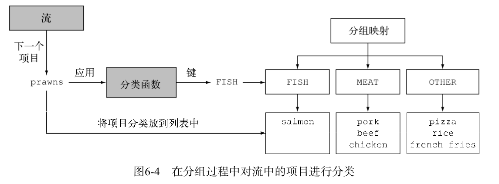

### 归约和汇总
在需要将流项目重组成集合时，一般会使用收集器（Stream方法collect的参数）再宽泛一点来说，但凡要把流中所有的项目合并成一个结果时就可以用  

#### 汇总
summingInt执行过程  
  

#### 连接字符串
joining工厂方法返回的收集器会把对流中每一个对象应用toString方法得到的所有字符串连接成一个字符串  
请注意， joining在内部使用了StringBuilder来把生成的字符串逐个追加起来  

#### 广义的归约汇总
事实上，我们已经讨论的所有收集器，都是一个可以用reducing工厂方法定义的归约过程的特殊情况而已。 Collectors.reducing工厂方法是所有这些特殊情况的一般化。可以说，先前讨论的案例仅仅是为了方便程序员而已。（但是，请记得方便程序员和可读性是头等大事！）,可以用reducing方法创建的收集器来计算你菜单的总热量  
它需要三个参数。  
* 第一个参数是归约操作的起始值，也是流中没有元素时的返回值，所以很显然对于数值和而言0是一个合适的值。
* 第二个参数就是你在6.2.2节中使用的函数，将菜肴转换成一个表示其所含热量的int。
* 第三个参数是一个BinaryOperator，将两个项目累积成一个同类型的值。  
可以把单参数reducing工厂方法创建的收集器看作三参数方法的特殊情况，它把流中的第一个项目作为起点，把恒等函数（即一个函数仅仅是返回其输入参数）作为一个转换函数  
>语义问题在于， reduce方法旨在把两个值结合起来生成一个新值，它是一个不可变的归约。与此相反， collect方法的设计就是要改变容器，从而累积要输出的结果。这意味着，上面的代码片段是在滥用reduce方法，因为它在原地改变了作为累加器的List。你在下一章中会更详细地看到，以错误的语义使用reduce方法还会造成一个实际问题：这个归约过程不能并行工作，因为由多个线程并发修改同一个数据结构可能会破坏List本身。在这种情况下，如果你想要线程安全，就需要每次分配一个新的List，而对象分配又会影响性能。这就是collect方法特别适合表达可变容器上的归约的原因，更关键的是它适合并行操作，本章后面会谈到这一点。  

简化前面使用reducing收集器的求和例子  
  

>int totalCalories = menu.stream().collect(reducing(0, Dish::getCalories, (i, j) -> i + j));  

reducing 方法创建的收集器
它需要三个参数。
* 第一个参数是归约操作的起始值,也是流中没有元素时的返回值,所以很显然对于数值
和而言 0 是一个合适的值。
* 第二个参数就是你在6.2.2节中使用的函数,将菜肴转换成一个表示其所含热量的 int 。
* 第三个参数是一个 BinaryOperator ,将两个项目累积成一个同类型的值。这里它就是
对两个 int 求和  

>Optional<Dish> mostCalorieDish = menu.stream().collect(reducing((d1, d2) -> d1.getCalories() > d2.getCalories() ? d1 : d2));

你可以把单参数 reducing 工厂方法创建的收集器看作三参数方法的特殊情况,它把流中的
第一个项目作为起点,把恒等函数(即一个函数仅仅是返回其输入参数)作为一个转换函数

#### 分组
>Map<Dish.Type, List<Dish>> dishesByType = menu.stream().collect(groupingBy(Dish::getType));  

这里,你给 groupingBy 方法传递了一个 Function (以方法引用的形式)
,它提取了流中每
一道 Dish 的 Dish.Type 。我们把这个 Function 叫作分类函数,因为它用来把流中的元素分成不
同的组。如图6-4所示,分组操作的结果是一个 Map ,把分组函数返回的值作为映射的键,把流中
所有具有这个分类值的项目的列表作为对应的映射值  
  

