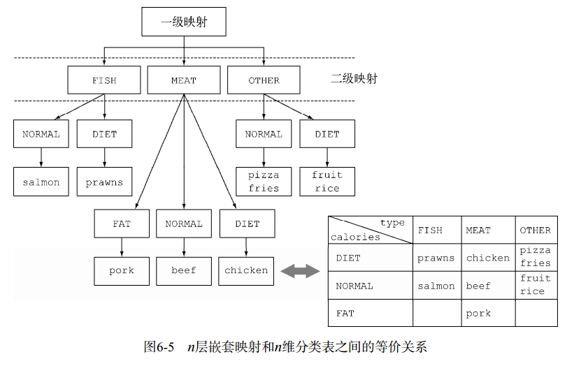
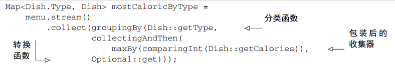
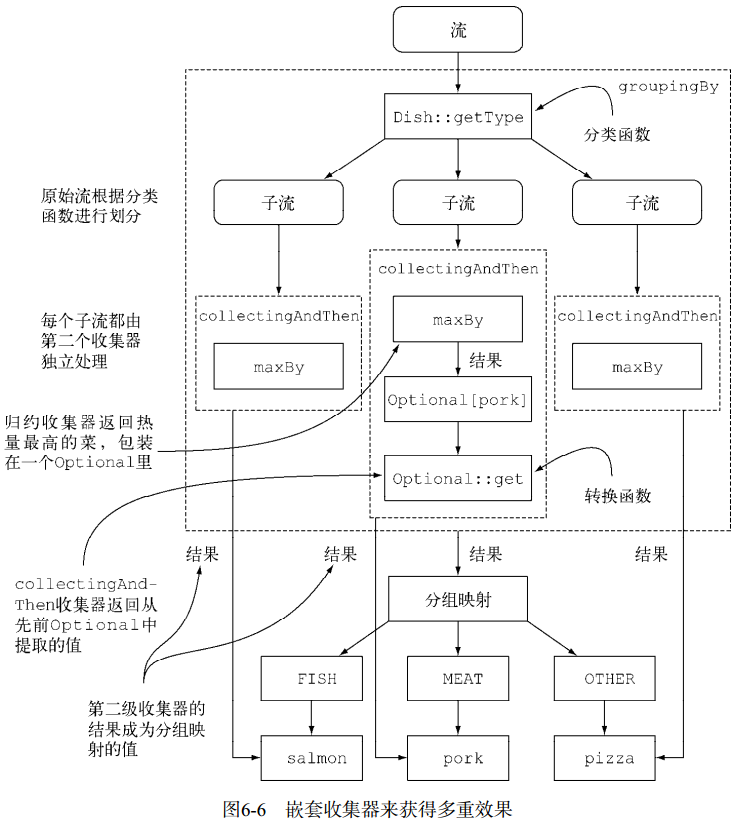

#### 多级分组
>要实现多级分组，我们可以使用一个由双参数版本的Collectors.groupingBy工厂方法创
建的收集器，它除了普通的分类函数之外，还可以接受collector类型的第二个参数。那么要进
行二级分组的话，我们可以把一个内层groupingBy传递给外层groupingBy  

  

#### 把收集结果转换为另一种类型
可以使用Collectors.collectingAndThen工厂方法返回的收集器  
  
这个工厂方法接受两个参数——要转换的收集器以及转换函数，并返回另一个收集器。这个
收集器相当于旧收集器的一个包装， collect操作的最后一步就是将返回值用转换函数做一个映
射。在这里，被包起来的收集器就是用maxBy建立的那个，而转换函数Optional::get则把返
回的Optional中的值提取出来。前面已经说过，这个操作放在这里是安全的，因为reducing
收集器永远都不会返回Optional.empty()  
把好几个收集器嵌套起来很常见，它们之间到底发生了什么可能不那么明显。图6-6可以直
观地展示它们是怎么工作的。从最外层开始逐层向里，注意以下几点。
* 收集器用虚线表示，因此groupingBy是最外层，根据菜肴的类型把菜单流分组，得到三
个子流。
* groupingBy收集器包裹着collectingAndThen收集器，因此分组操作得到的每个子流
都用这第二个收集器做进一步归约。
* collectingAndThen收集器又包裹着第三个收集器maxBy。
* 随后由归约收集器进行子流的归约操作，然后包含它的collectingAndThen收集器会对
其结果应用Optional:get转换函数。
* 对三个子流分别执行这一过程并转换而得到的三个值，也就是各个类型中热量最高的
Dish，将成为groupingBy收集器返回的Map中与各个分类键（Dish的类型）相关联的值。
