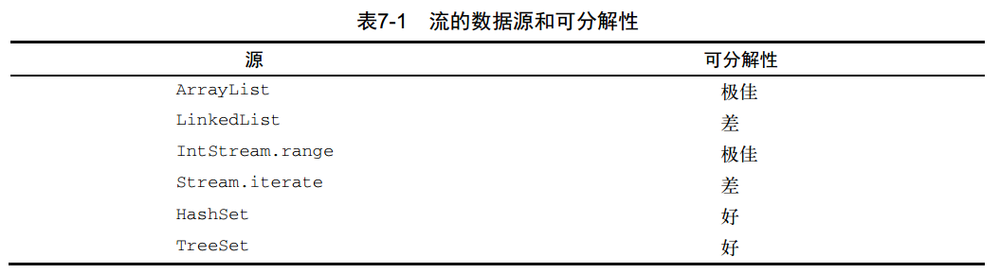

### 并行流
#### 高效使用并行流
一般而言，想给出任何关于什么时候该用并行流的定量建议都是不可能也毫无意义的，因为
任何类似于“仅当至少有一千个（或一百万个或随便什么数字）元素的时候才用并行流）”的建
议对于某台特定机器上的某个特定操作可能是对的，但在略有差异的另一种情况下可能就是大错
特错。尽管如此，我们至少可以提出一些定性意见，帮你决定某个特定情况下是否有必要使用并
行流。  
* 如果有疑问，测量。把顺序流转成并行流轻而易举，但却不一定是好事。我们在本节中
已经指出，并行流并不总是比顺序流快。此外，并行流有时候会和你的直觉不一致，所
以在考虑选择顺序流还是并行流时，第一个也是最重要的建议就是用适当的基准来检查
其性能。
* 留意装箱。自动装箱和拆箱操作会大大降低性能。 Java 8中有原始类型流（IntStream、
LongStream、 DoubleStream）来避免这种操作，但凡有可能都应该用这些流。
* 有些操作本身在并行流上的性能就比顺序流差。特别是limit和findFirst等依赖于元
素顺序的操作，它们在并行流上执行的代价非常大。例如， findAny会比findFirst性
能好，因为它不一定要按顺序来执行。你总是可以调用unordered方法来把有序流变成
无序流。那么，如果你需要流中的n个元素而不是专门要前n个的话，对无序并行流调用
limit可能会比单个有序流（比如数据源是一个List）更高效。
* 还要考虑流的操作流水线的总计算成本。设N是要处理的元素的总数， Q是一个元素通过
流水线的大致处理成本，则N*Q就是这个对成本的一个粗略的定性估计。 Q值较高就意味
着使用并行流时性能好的可能性比较大。
* 对于较小的数据量，选择并行流几乎从来都不是一个好的决定。并行处理少数几个元素
的好处还抵不上并行化造成的额外开销。
* 要考虑流背后的数据结构是否易于分解。例如， ArrayList的拆分效率比LinkedList
高得多，因为前者用不着遍历就可以平均拆分，而后者则必须遍历。另外，用range工厂
方法创建的原始类型流也可以快速分解。最后，你将在7.3节中学到，你可以自己实现
Spliterator来完全掌控分解过程。
* 流自身的特点，以及流水线中的中间操作修改流的方式，都可能会改变分解过程的性能。
例如，一个SIZED流可以分成大小相等的两部分，这样每个部分都可以比较高效地并行处
理，但筛选操作可能丢弃的元素个数却无法预测，导致流本身的大小未知。
* 还要考虑终端操作中合并步骤的代价是大是小（例如Collector中的combiner方法）。
如果这一步代价很大，那么组合每个子流产生的部分结果所付出的代价就可能会超出通
过并行流得到的性能提升。
表7-1按照可分解性总结了一些流数据源适不适于并行。  

