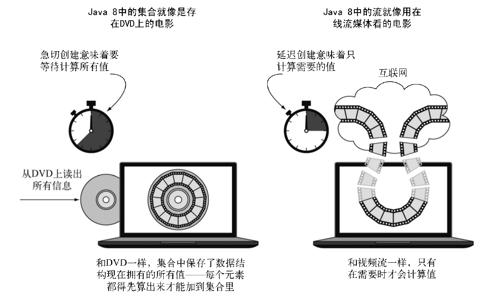
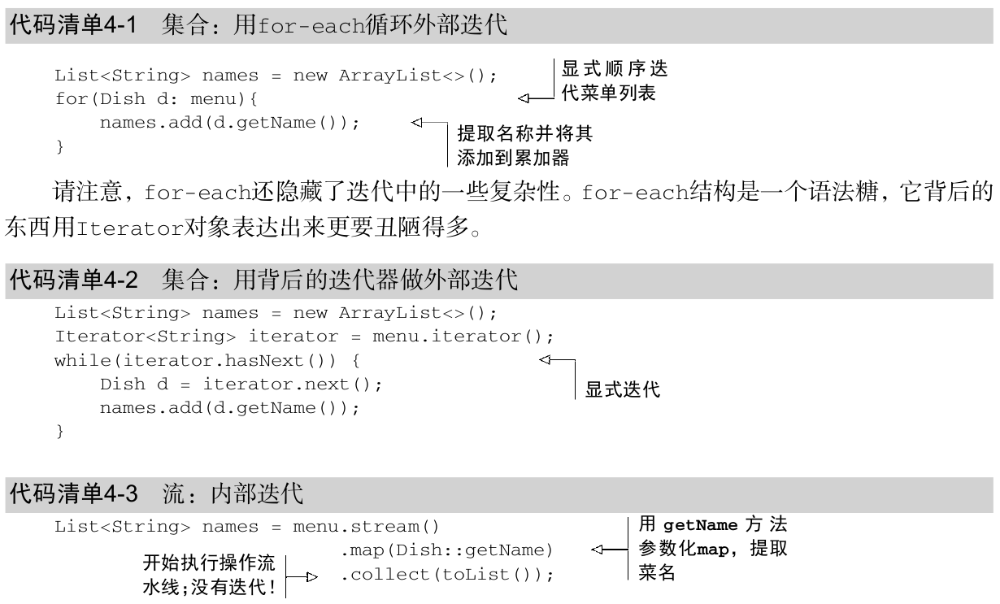
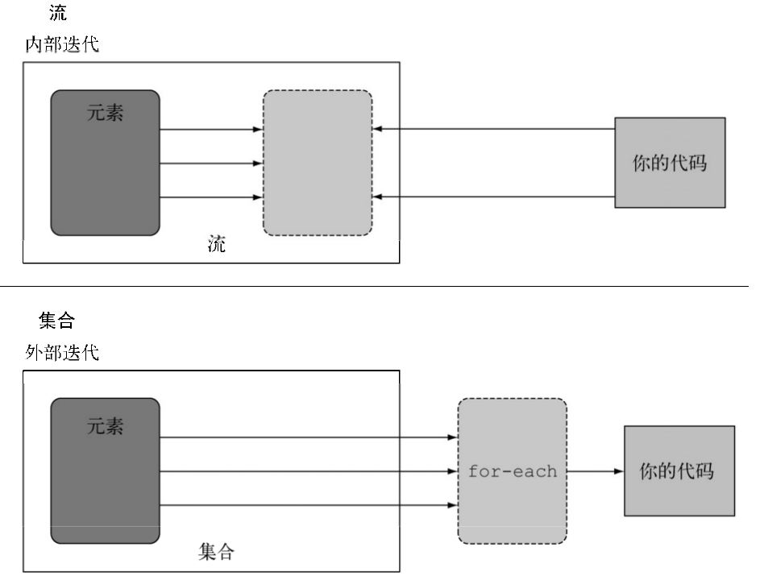

## 需要把该文件整合到REMODE.MD中

* filter ——接受Lambda,从流中排除某些元素。在本例中,通过传递lambda d -> d.getCalories() > 300 ,选择出热量超过300卡路里的菜肴。  
* map ——接受一个Lambda,将元素转换成其他形式或提取信息。在本例中,通过传递方法引用 Dish::getName ,相当于Lambda d -> d.getName() ,提取了每道菜的菜名。   
* limit ——截断流,使其元素不超过给定数量。  
* collect ——将流转换为其他形式.  

### 集合和流的概念区别

#### 集合
>粗略地说,集合与流之间的差异就在于什么时候进行计算。集合是一个内存中的数据结构,
它包含数据结构中目前所有的值——集合中的每个元素都得先算出来才能添加到集合中。
(你可以往集合里加东西或者删东西,但是不管什么时候,集合中的每个元素都是放在内存里的,元素都得先算出来才能成为集合的一部分。)  

#### 流
>相比之下,流则是在概念上(逻辑上)固定的数据结构(你不能添加或删除元素),其元素则是按需计算的。 这对编程有很大的好处。在第6章中,我们将展示构建一个质数流(2, 3, 5, 7, 11, ...)有多简单,尽管质数有无穷多个。这个思想就是用户仅仅从流中提取需要的值,而这些值——在用户看不见的地方——只会按需生成。这是一种生产者-消费者的关系。从另一个角度来说,流就像是一个延迟创建的集合:只有在消费者要求的时候才会计算值(用管理学的话说这就是需求驱动,甚至是实时制造)  

#### 实际区别
>与此相反,集合则是急切创建的(供应商驱动:先把仓库装满,再开始卖,就像那些昙花一
现的圣诞新玩意儿一样)。以质数为例,要是想创建一个包含所有质数的集合,那这个程序算起
来就没完没了了,因为总有新的质数要算,然后把它加到集合里面。当然这个集合是永远也创建
不完的,消费者这辈子都见不着了

>另一个例子是用浏览器进行互联网搜索。假设你搜索的短语在Google或是网店里面有很多匹
 配项。你用不着等到所有结果和照片的集合下载完,而是得到一个流,里面有最好的10个或20
 个匹配项,还有一个按钮来查看下面10个或20个。当你作为消费者点击“下面10个”的时候,供
 应商就按需计算这些结果,然后再送回你的浏览器上显示  

下图用DVD对比在线流媒体的例子展示了流和集合之间的差异  
  

#### 只能遍历一次
>请注意,和迭代器类似,流只能遍历一次。遍历完之后,我们就说这个流已经被消费掉了。
你可以从原始数据源那里再获得一个新的流来重新遍历一遍,就像迭代器一样(这里假设它是集
合之类的可重复的源,如果是I/O通道就没戏了)  

### 内部迭代和外部迭代
>使用 Collection 接口需要用户去做迭代(比如用 for-each ),这称为外部迭代。 相反,
Streams库使用内部迭代——它帮你把迭代做了,还把得到的流值存在了某个地方,你只要给出
一个函数说要干什么就可以了  

#### 代码清单

##### 4-3的好处是
* 代码是以声明性方式写的:说明想要完成什么(筛选热量低的菜肴)而不是说明如何实现一个操作(利用循环和 if条件等控制流语句)。你在前面的章节中也看到了,这种方法加上行为参数化让你可以轻松应对变化的需求:你很容易再创建一个代码版本,利用Lambda表达式来筛选高卡路里的菜肴,而用不着去复制粘贴代码。
* 你可以把几个基础操作链接起来,来表达复杂的数据处理流水线(在 filter 后面接上sorted 、 map 和 collect 操作,如图4-1所示),同时保持代码清晰可读。 filter 的结果被传给了 sorted 方法,再传给 map 方法,最后传给 collect 方法。

#### 迭代的差异
让我们用一个比喻来解释内部迭代的差异和好处吧。比方说你在和你两岁的女儿索菲亚说话,希望她能把玩具收起来  
>你:“索菲亚,我们把玩具收起来吧。地上还有玩具吗?”  
索菲亚:“有,球。”  
你:“好,把球放进盒子里。还有吗?”  
索菲亚:“有,那是我的娃娃。”  
你:“好,把娃娃放进盒子里。还有吗?”  
索菲亚:“有,有我的书。”  
你:“好,把书放进盒子里。还有吗?”  
索菲亚:“没了,没有了。”  
你:“好,我们收好啦。”  

这正是你每天都要对Java集合做的(类似与代码清单4_1和4_2,按照collection的顺序一个一个的迭代)。你外部迭代一个集合,显式地取出每个项目再加以处理。如果你只需跟索菲亚说“把地上所有的玩具都放进盒子里”就好了。内部迭代比较好的原因有二:第一,索非亚可以选择一只手拿娃娃,另一只手拿球(并行执行);第二,她可以决定先拿离盒子最近的那个东西,然后再拿别的(优化顺序)。同样的道理,**内部迭代时,项目可以透明地并行处理,或者用更优化的顺序进行处理**。要是用Java过去的那种外部迭代方法,这些优化都是很困难的。这似乎有点儿鸡蛋里挑骨头,但这差不多就是**Java 8引入流的理由了——Streams库的内部迭代可以自动选择一种适合你硬件的数据表示和并行实现**。与此相反,一旦通过写 for-each 而选择了外部迭代,那你基本上就要自己管理所有的并行问题了(自己管理实际上意味着“某个良辰吉日我们会把它并行化”或“开始了关于任务和synchronized的漫长而艰苦的斗争”)。 Java8需要一个类似于Collection 却没有迭代器的接口,于是就有了Stream!下图说明了流(内部迭代)与集合(外部迭代)之间的差异。  
  

#### 中间操作
>诸如filter或sorted等中间操作会返回另一个流。这让多个操作可以连接起来形成一个查询。重要的是，除非流水线上触发一个终端操作，否则中间操作不会执行任何处理——它们很懒。这是因为中间操作一般都可以合并起来，在终端操作时一次性全部处理。  

中间操作返回一个流，但如果没有终端操作，所有中间操作都不会执行

#### 终端操作
>终端操作会从流的流水线生成结果。其结果是任何不是流的值，比如List、 Integer，甚至void  

#### 使用流
###### 总而言之，流的使用一般包括三件事：
* 一个数据源（如集合）来执行一个查询；
* 一个中间操作链，形成一条流的流水线；
* 一个终端操作，执行流水线，并能生成结果。  

#### 4.5小结
以下是你应从本章中学到的一些关键概念。
* 流是“从支持数据处理操作的源生成的一系列元素”。
* 流利用内部迭代：迭代通过filter、 map、 sorted等操作被抽象掉了。
* 流操作有两类：中间操作和终端操作。
* filter和map等中间操作会返回一个流，并可以链接在一起。可以用它们来设置一条流水线，但并不会生成任何结果。
* forEach和count等终端操作会返回一个非流的值，并处理流水线以返回结果。
* 流中的元素是按需计算的。  

##差5_1的练习
